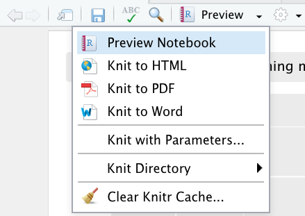
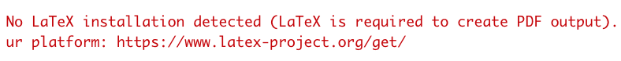

# Notebooks exporteren
Je kunt via R studio je Notebooks naar verschillende bestandsformaten: als HTML file of als PDF.
Belangrijk hierbij is om te weten wat er dan eigenlijk gebeurt en wat je moet checken.

Exporteren werkt als volgt:

  

Als je op Knit to *...* klikt worden alle chunks achter elkaar uitgevoerd en ontstaat een HTML of PDF bestand in dezelfde directory als waar je .Rmd bestand staat.

Dingen waar je op moet letten, omdat dit fouten kan voorkomen:
- Alle **file referenties** voor bijvoorbeeld importeren van je dataset moeten kloppen! Alle files worden gezocht relatief t.o.v. de locatie waar je Notebook zich bevindt.
- Je zult expliciet een bestand, database of andere bron voor je dataset moeten laden in je Notebook via bijvoorbeeld de read_excel functie (alleen via het menu importeren en de data in het werkgeheugen van RStudio hebben staan werkt niet als je een Notebook knit).
- Foutmelding wijzen je vaak op potentiele issues, lees ze dus goed en Google eventueel wat ze betekenen. Er is een aantal functies die het wel doen als je je Notebook met de hand uitvoert, maar niet als je je Notebook knit (zoals de functie 'View').
- Notebooks waarbij authenticatie een rol speelt (API's) zijn tricky om te exporteren. Als een export draait, is er **geen interactie** mogelijk. Je moet je Notebook dan dus zo configureren dat er geen authenticatie o.i.d. nodig is.
- Om naar PDF te exporteren heb je een aparte package nodig. Heb je die niet, dan krijg je waarschijnlijk deze fout als je het toch probeert:
  
    Installeer dan (via de console) TinyTex :
     `tinytex::install_tinytex()`  
