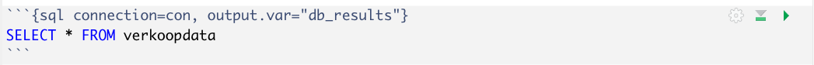

# Data bronnen
R is bij uitstek geschikt om data uit diverse bronnen te importeren en te gebruiken. Vaak zul je met gestructureerde data (data in bijvoorbeeld tabelvorm) werken, maar R kan ook met ongestructureerde data (zoals tekst) werken.  
Veelvoorkomend zijn:
- CSV/XLSX/TXT
- Databases, zoals MySQL, SQLite, MSSQL..
- API's
- JSON

We gaan hier in op een aantal voorbeelden, maar een Google zoekopdracht met *Rstudio import data from...* helpt je vaak al!

## 1. Importeren van CSV/Excel/TXT data
Data in CSV, Excel (xlsx) of .txt bestanden is over het algemeen vrij eenvoudig te importeren. Zeker als je net begint met R, zijn dit de meest gebruikte databronnen. Toch zijn er wel wat aandachtspunten die je kunnen helpen om probleemloos de data in je Notebook te krijgen.

Voor alle soorten textbestanden geldt dat je even moet checken met behulp van Excel, of een text editor als Visual Studio Code of Atom of Notepad of de bestanden:
- Kolomkoppen gebruiken
- Vrij zijn van uitleg (of iets dergelijks) op de eerste regels, die moet je er dan even uit halen

In dit [**support artikel**](https://support.rstudio.com/hc/en-us/articles/218611977-Importing-Data-with-RStudio) wordt uitgelegd hoe je data in dit soort bestanden kunt importeren in RStudio.
Een paar aandachtspunten:
- Als je de import dataset wizard gebruikt voor Excel/CSV
    - CSV bestanden gebruiken een scheidingsteken (een komma, tab of semicolon). Dat heet de `delimiter`. In je import statement zal dat dus ergens terug komen.
    - Kopieer de code die rechtsonder in het venstertje `code preview` wordt getoond, **behalve** het `View(...)` stukje.
    - Plak dat stuk code in een chunk, liefst bovenin je Notebook, ergens nadat je libraries hebt geladen.
    - Run de chunk om te controleren.   
    Daarmee gaat het knitten van je code vaak meteen een stuk beter omdat je geen fouten krijgt over data die niet gevonden kan worden.
- Om XLSX files te laden, heb je de library `readxl` of `read_excel` nodig. Als je Excel bestand meerdere tabbladen heeft, kun je data uit een specifiek tabblad (worksheet) importeren door deze als 2e paramter in de import mee te geven. Bijvoorbeeld: `my_data <- read_excel("my_file.xls","sheet2")`
- CSV en TXT werken het beste i.c.m. de `readr` library. 

## 2. Importeren van data uit een database
**Let op:** We gaan hier alleen in op het verbinding maken met een databse. Hoe je SQL kunt gebruiken in R/RStudio komt ergens anders aan bod.

Databases komen in vele varianten en van vele leveranciers. Hier proberen we je te helpen om te werken met 2 veelgebruikte databases in het startsemester: een SQLite database en een MySQL database.
- SQLite databases zijn zogenaamde *portable databases*,  databases in de vorm van een bestandje (bijvoorbeeld een .db of .sqlite bestand)
- MySQL is een hosted database (bijvoorbeeld op de FHICT servers), deze benaderen we via een url en eventueel via een VPN-verbinding.

### Verbinden met een SQLite database
1. Library gebruiken/installeren.   
    De meest gebruikte library hiervoor is `library(RSQLite)`
2. Verbinding maken (connectie), met het huiste bestand.  
    Bijvoorbeeld: `con <- dbConnect(SQLite(), "verkopen.db")`   
    `con` is het object/element dat je in het vervolg gebruikt om queries uit te voeren op de database.
3. Test door bijvoorbeeld alle tabelnamen op te halen.  
    `dbListTables(con)`

Je hebt het nu voor elkaar om gegevens uit de database op te vragen.   Je kunt een SQL chunk in te voegen in je Notebook en de output van een SQL query in een dataframe opslaan. Hieronder een voorbeeld. 

**Let op:** de bovenste regel zijn de parameters van een SQL chunk
 

Meer informatie en hulp:
- [Datacamp tutorial](https://www.datacamp.com/community/tutorials/sqlite-in-r)
- [R tutorial & hulpfiles](https://db.rstudio.com/databases/sqlite/)

### Verbinden met een MySQL database
Om  gegevens uit een MySQL database op te kunnen halen moet je een paar zaken weten/regelen:
- Heb je een actieve VPN-verbinding nodig? (Dat is bijvoorbeeld bij de FHICT MySQL databases wel nodig!) Zorg dan dat deze actief is op de machine waarop je werkt.
- Je hebt een url, username en wachtwoord nodig.  
    Die van de FHICT MySQL database kun je vinden via de [selfservice portal](https://selfservice.app.fhict.nl/Database/Mysql)

Als je dit weet/geregeld hebt, werkt het bijna net als met SQLite, maar het opbouwen van de connectie is net iets uitgebreider.

1. Library gebruiken/installeren.  
     `library(RMariaDB)` en `library(DBI)`.  
     Deze libraries bevatten *drivers* voor verschillende database types
2. Verbinding maken mbv een connectie string.  
    Bijvoorbeeld:
> `con = dbConnect(RMariaDB::MariaDB(), user='dbi123456', password='Wachtwoord', dbname='dbi123456', host='studmysql01.fhict.local')`
3. Zie voor het opvragen van data de zelfde aanpak als bij SQLite.

Meer info via dit [artikel](https://db.rstudio.com/databases/my-sql/)

## 3. Verbinden met een API
Application Programming Interfaces zijn een soort digitale butlers, waarbij data via een url kan worden opgevraagd.
Bijvoorbeels iets als:
>`http://myorg.com/api/getUsers`

zou een JSON text bestand met alle users terug kunnen geven.

Veel bekende cloud diensten hebben (betaalde) API's die je kunt gebruiken, denk bijvoorbeeld aan Spotify of Google Analytics. Om gebruik te kunnen maken van zo'n dienst heb je vaak een developer account nodig en krijg je een eigen *sleutel* waarmee de API jou kan identificeren en de juiste toegang geeft.

In R zijn er kant en klare libraries die veel van de handelingen in het werken met een API (authenticatie etc) voor je regelen.

Dit is een onderwerp dat past bij de verdieping (en verder), maar mocht je hier mee aan de slag willen, check dan eens:
- [Spotify & R tutorial](https://medium.com/swlh/accessing-spotifys-api-using-r-1a8eef0507)
- [Open Weather map](https://github.com/mukul13/ROpenWeatherMap)
