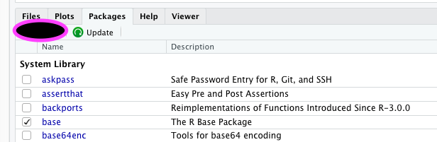

# Over libraries (packages)
Omdat je niet iedere keer het wiel opnieuw wil uitvinden, kun je gebruik maken van setjes voorgedefinieerde functionaliteit. Zie Rstudio als een kale Word of Excel, waarbij je de ribbon vult met knoppen door zelf libraries (of packages zoals programmeurs zeggen) toe te voegen.
Er zijn libraries met functies, maar ook libraries met data (zoals gapminder uit Datacamp). Ook hebben specifieke databronnen vaak hun eigen library (denk aan [GoogleAnalyticsR](https://code.markedmondson.me/googleAnalyticsR/), SQLServer/MySQL of [SpotifyR](https://www.rdocumentation.org/packages/spotifyr/versions/1.0.0)])

Libraries installeren hoef je alleen te doen als je RStudio zelf geïnstalleerd hebt op je eigen machine, of als je op RStudio Cloud werkt. Op de FHICT RStudio server zijn alle libraries die je in de oriëntatie nodig hebt als het goed is al geïnstalleerd. Da hoef je dus geen libraries installeren tenzij je speciale dingen doet of misschien als je de verdieping volgt. Je moet een library wel importeren in je Notebook en de chunk uitvoeren om de inhoud van de library te kunnen gebruiken.

## Gebruiken van libraries
Omdat Notebooks geschikt zijn om over te dragen aan iemand anders en jouw bevindingen te reproduceren, moet die persoon ook weten welke libraries je daarvoor gebruikt hebt. Daarom laad je in ieder Notebook expliciet de benodigde libraries in.

Goed gebruik is om dat meteen in het begin van je document te doen en daar 1 chunk te maken waarin je de setup doet. Zoiets als hieronder dus:
> `library("tidyverse")`  
> `library("ggplot2")`

Dan komt een lezer niet halverwege allerlei nieuwe libraries tegen en heb je een goed beeld van de benodigde afhankelijkheden.

Als je losse chunks uitvoert in je Notebook is het handig om erop te letten dat je 'alles wat je nodig hebt' in een bepaalde chunk van te voren uitvoert.

## Installeren  nieuwe libraries
Krijg je een melding in je Notebook in de richting van `could not find..` of `could not load..` en heb je volgens jou wel de juiste library al opgenomen in je Notebook, dan heb je dikke kans dat je een library mist waaruit je functionaliteit probeert te gebruiken.

Libraries installeren **doe je niet vanuit een Notebook**, omdat dit een eenmalige actie is. Het gebruiken van een library doe je wel in je Notebook.

Installatie kan op 2 manieren:
- Via de GUI van RStudio.  
Klik op Install en vervolgens tik je de naam van de library in.
  
Zoals je ziet kun je hier ook vinden welke libraries er al geïnstalleerd zijn.

- Ben je iets meer nerd, wil je sneller aan de slag, of moet je eventuele installatie issues oplossen? Dan gebruik je uiteraard de console! Deze vind je standaard in het vak rechtsonder, en kun je ook altijd via het menu naar voren toveren als je dat vak per ongeluk uitgezet hebt.   
In een `install.packages()` commando geef je dan aan welke library je wilt installeren, bijvoorbeeld: 
    `install.packages("tidyverse")`

    De console vind je normaal gesproken links onderaan.