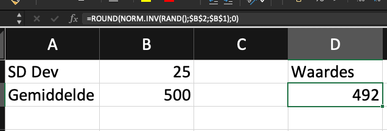
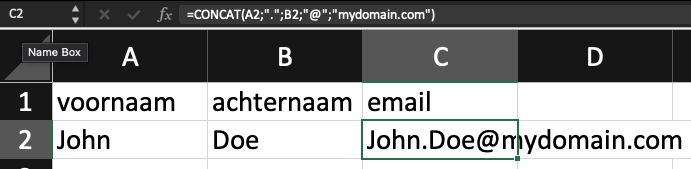

# Waarom Mockdata?
Mockdata, oftewel testdata, is heel handig om bijvoorbeeld te oefenen met je vaardigheden of je notebooks te prepareren voordat je de echte klant data krijgt. Stel dat je bv wacht op een export of database toegang, dan kun je door gebruik te maken van het datamodel van de dataset, zelf vast oefendata maken. Ook maakt goede test data het makkelijker om te begrijpen wat je bedoelt als tester.

# Bepalen eisen aan je mockdata
Een datamodel beschrijft welke relaties, kolommen & datatypes je data bevat. Met behulp van een ER-Model kun je dat opstellen. als je bv werkt met externe data via API's, dan kun je gebruik maken van de API documentatie. zo beschrijft bv Google of Spotify welke data ze aanleveren en in welk formaat.
Je moet je bv afvragen:
- Hoeveel records heb ik nodig?
- Moet er (statistische) spreiding in je data zitten?
- Zitten er onderlinge afhankelijkheden in mn data (als waarde a = x, dan b = y)
- wil je ook 'foute' data genereren, bv lege cellen/waardes?

# Realiseren Mockdata
In de praktijk kun je vaak toe met de eerste optie, Mockaroo. Soms kan het voor het verder bewerken van je mock data handig zijn met Excel nog wat te doen en als je eenvoudige data wil, dan kan R deze ook voor je genereren.
## [Mockaroo](http://www.mockaroo.com){:target="_blank"}
Op zich wijst Mockaroo zichzelf wel, en er zijn legio tutorials te vinden. toch een paar tips:
- Gebruik **Custom Lists** als datatype als je zelf wil bepalen uit welke range van waardes je een kolom wil vullen. bv: je wil klantendata genereren en hebt een kolom `abonnementsvorm` die de waardes **Gold**.**Silver**,**Bronze** heeft. mbv een custom list en een custom distribution kun je dan bv aangeven dat voor iedere Gold klant er 3 Silver en 5 Bronze klanten zijn

- Je kan mbv de ingebouwde syntax/formules nog meer aanpassen, zie de [formula help](https://www.mockaroo.com/help/formulas){:target="_blank"}

## Excel
Excel is behoorlijk krachtig als het gaat om data bewerking en door slim gebruik te maken van diverse (minder bekende) functies kun je je eigen data nog aardig vorm geven. Een paar voorbeelden:

### 1. Excel - Normaal verdeelde data aanmaken
Als je een beetje iets van statistiek weet, dan zelgt het begrip [normaal verdeling](https://nl.wikipedia.org/wiki/Normale_verdeling) je wel iets. In Excel kun je op basis van een gemiddelde en standaard deviatie een dataset genereren. Zie dit voorbeeld voor waardes die rond de 500 liggen met een standaard deviatie van 25.

> Formule `=ROUND(NORM.INV(RAND();$B$2;$B$1);0)`
met het bekende plusje sleep je de waarde (492) omlaag en genereer je meerdere waardes

### 2. Excel - Samenvoegen
Een veel gebruikte functie is het samenvoegen van 2 of meer tekstwaardes, het zogenaamde *concateneren*. Dat doe je bv als je email adressen wil maken obv de voornaam en achternaam.

> Formule `=CONCAT(A2;".";B2;"@";"mydomain.com")`

### 3. Excel - Lookup
Een van de meest gebruikte functies in Excel is misschien de [(V/H)Lookup functie](https://exceljet.net/excel-functions/excel-vlookup-function). Deze kun je bv gebruiken om artikelnummers te vertalen naar cetegorien. Stel: je wil een artikel dat eindigt op een cijferrange (1 tm 3 bv) koppelen aan een categorie *witgoed*
- eerst het meest rechts karakter uit het artikelnr halen mbv de `Right` functie.
- Die waarde als nummer converteren mbv de `INT` functie.
- Resultaat aan de Vlookup meegeven. Let op de $ bij de opzoektabel 

> Formule  `=VLOOKUP(INT(RIGHT(A2;1));$D$1:$E$11;2;FALSE)`

## R
Als je eenvoudige data (een lijst met random nummers oid) wil genereren, kan dat ook in R zelf. zie dit [ebook voor het hoe en wat](https://bookdown.org/ndphillips/YaRrr/generating-random-data.html)