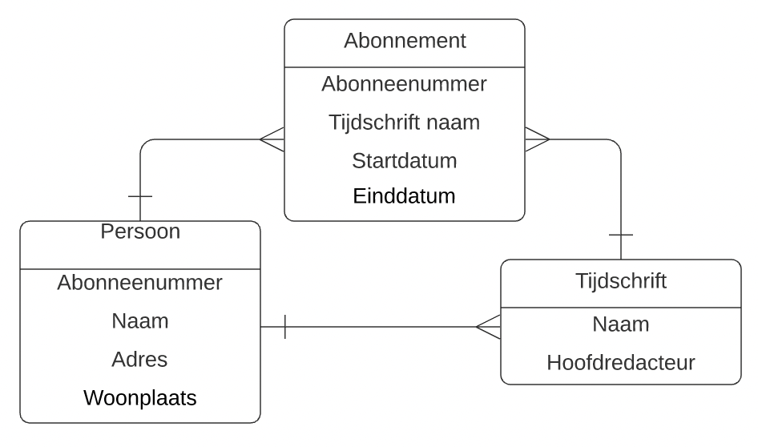

Vanuit gestructureerde gegevens een ERD maken is relatief eenvoudig. Een ERD maken vanuit een verhaaltje of je eigen idee is een stuk lastiger. In deze oefening ga je aan de slag met een simpel verhaaltje waarbij een ERD gegeven is.   
Ontdek de fouten (het zijn er meerdere) in het ERD en doe een suggestie voor verbeteringen.

# Doel
- Fouten in een ERD herkennen op basis van een beschrijvend verhaal;
- ERD kunnen opstellen vanuit een beschrijvend verhaal.

# Voorkennis
- ERD syntax

# Opgave
Hieronder staat een verhaaltje waar een ERD bij getekend is.
* Wat klopt er volgens jou allemaal niet aan het ERD?
* Teken een verbeterde versie.

Een uitgeverij geeft tijdschriften uit. Een persoon heeft zich geabonneerd op een tijdschrift. Een tijdschrift heeft een unieke naam, een hoofdredacteur en een oplage. Een persoon heeft een abonneenummer, een naam, een adres en een woonplaats.   

Abonnees zijn gedurende bepaalde periodes op een of meerdere tijdschriften geabonneerd (geweest). We willen een overzicht kunnen per abonnee per periode op welke tijdschriften deze geabonneerd was (is). 

